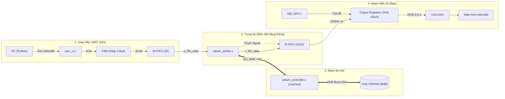

# BÁO CÁO KỸ THUẬT TOÀN DIỆN: DỰ ÁN SDRAM VGA VIDEO FRAMEBUFFER
**Hệ thống Streaming Ảnh 640x480 @ 60Hz qua SDRAM và VGA trên KIT Terasic DE1**

> [!NOTE]
> Báo cáo này tổng hợp lại kiến trúc hệ thống, phân tích sâu về bản chất vật lý của SDRAM, và chi tiết hóa 4 chặng gỡ lỗi (debug) sinh tử để đưa hệ thống từ chỗ màn hình tối thui đến khi hiển thị một bức ảnh hoàn hảo.

---

## PHẦN 1: MỔ XẺ SDRAM VÀ NHỮNG BẤT TIỆN "CHÍ MẠNG"
Để hiểu tại sao hệ thống lại gặp vô vàn lỗi hiểm hóc như vậy trong quá trình kiểm tra, chúng ta cần lật lại bản chất vật lý của hai loại chip nhớ: SRAM và SDRAM.

### 1. Tại sao SDRAM lại là "Ác mộng" so với SRAM?

| Đặc tả | SRAM (Project 1) | SDRAM (Project 2) |
| :--- | :--- | :--- |
| **Cấu trúc ô nhớ** | 6 Transistor (Mạch lật Bistable) | 1 Transistor + 1 Tụ điện siêu nhỏ (1T1C) |
| **Bảo toàn dữ liệu** | Giữ vĩnh viễn khi có điện | Rò điện liên tục, phải tự động sạc lại (Refresh) sau vài mili-giây |
| **Cách thức truy xuất**| Ngẫu nhiên (Random Access), độc lập | Khối (Burst Access), phụ thuộc Máy trạng thái phức tạp |
| **Độ trễ đọc/ghi** | Đều đặn 10-20ns cho mọi ô nhớ | Rất chậm khi mở/đóng hàng, nhưng cực nhanh khi xả Burst |

### 2. Bốn bất tiện cốt lõi sinh ra hàng loạt lỗi hệ thống
Chính cấu trúc **"1 Transistor + 1 Tụ điện"** của SDRAM đã đẻ ra những giới hạn vật lý bắt buộc chúng ta phải tuân theo, từ đó gây ra những khó khăn vô cùng lớn trong việc thiết kế mạch điều khiển:

1. **Ác mộng Auto-Refresh (Nạp lại điện tích):** Tụ điện bị rò điện, nên cứ mỗi **$15.6 \ \mu\text{s}$**, SDRAM phải đóng băng mọi hoạt động đọc/ghi để tự sạc lại điện (Auto-Refresh). Nếu đúng lúc này màn hình VGA đang khát dữ liệu, nó sẽ không được phục vụ và sinh ra nhiễu/rác trên màn hình.
2. **Độ trễ mở/đóng hàng (Row/Column Latency):** SDRAM giống như một thư viện. Muốn lấy 1 cuốn sách, bạn không thể bốc ngay (như SRAM) mà phải làm thủ tục: Kích hoạt hàng (`ACTIVE`) $\rightarrow$ Mất 2 chu kỳ. Yêu cầu cột (`READ`) $\rightarrow$ Đợi thêm 3 chu kỳ (`CAS Latency`). Lấy xong phải đóng lại (`PRECHARGE`) $\rightarrow$ Mất thêm 2 chu kỳ. Tổng cộng mất gần **10 chu kỳ clock** chỉ để lấy 1 pixel ngẫu nhiên.
3. **Bắt buộc phải xả Burst (Burst Mode):** Để bù đắp độ trễ mở hàng, ta phải cấu hình SDRAM xả một đợt 256 pixel liên tục ở tốc độ cực cao (20ns/pixel). Sự mất cân bằng này (lúc thì ngâm quá lâu, lúc thì xả quá nhanh) buộc hệ thống phải có các hồ chứa (FIFO) rất sâu để trung hòa tốc độ với màn hình VGA (40ns/pixel).
4. **Xung nhịp bị lệch pha (Phase Shift):** Chip SDRAM nằm độc lập trên bo mạch, tín hiệu phải đi qua hệ thống đường mạch đồng. Điều này sinh ra độ trễ. Để dữ liệu không bị lệch nhịp khi FPGA đọc, ta phải cấp cho SDRAM một xung nhịp đảo pha 180 độ (`~CLOCK_50`).

---

## PHẦN 2: HÀNH TRÌNH DEBUG - 4 CHẶNG ĐƯỜNG VƯỢT ẢI

Quá trình tích hợp SDRAM với VGA không hề suôn sẻ. Dưới đây là biên niên sử chi tiết về 4 chặng lỗi từ lúc hệ thống tê liệt hoàn toàn đến khi bức ảnh hiển thị hoàn hảo.

### Chặng 1: Màn hình tối thui (VGA không hoạt động)
- **Biểu hiện:** Sau khi nạp code, màn hình VGA đen kịt hoàn toàn. Đèn LED trên màn hình nhấp nháy báo trạng thái Standby (No Signal - Không nhận được tín hiệu quét).
- **Nguyên nhân:** Khối đếm tọa độ pixel (`vga_sync.v`) cần một xung nhịp Enable 25MHz để hoạt động. Tuy nhiên, ở phiên bản đầu, chân `.ce()` của module này bị bỏ trống không kết nối. Mạch bị thả nổi và ghim ở mức 0, khiến bộ đếm tọa độ ngang/dọc bị tê liệt hoàn toàn.
- **Cách Fix:** Tạo một thanh ghi chia đôi xung nhịp `reg ce` (từ 50MHz xuống 25MHz) trong `top_module` và nối trực tiếp vào chân `.ce(ce)` của khối VGA Sync. Màn hình lập tức nhận được tín hiệu và chuyển sang trạng thái "Active Black" (sáng mờ, sẵn sàng hiển thị).

### Chặng 2: Chết lâm sàng - Deadlock hệ thống
- **Biểu hiện:** Màn hình đã sáng mờ, cáp UART từ PC đã báo nạp thành công 100% dữ liệu, nhưng màn hình vẫn đen thui, không có bất kỳ điểm ảnh hay rác nào xuất hiện. 
- **Nguyên nhân:** Bắt tay hụt (Handshake Deadlock) giữa khối Trọng tài (Arbiter) và Bộ điều khiển (SDRAM Controller). Khi Arbiter phất cờ yêu cầu Ghi (`sys_write_req`), Controller tiếp nhận và nhảy sang trạng thái `ACTIVE_ROW` (mất vài chu kỳ). Nhưng ngay lúc đó, Arbiter lại vội vã hạ cờ yêu cầu xuống. Tới lúc Controller chuyển sang trạng thái `WRITE_COL` và kiểm tra lại cờ thì thấy cờ đã mất. Controller bị kẹt vĩnh viễn ở trạng thái chờ lệnh, hệ thống "chết lâm sàng".
- **Cách Fix:** Áp dụng nguyên tắc "Chốt lệnh" (Latching). Thêm các thanh ghi nội bộ (`is_write`, `latched_addr`, `latched_data`) vào bên trong SDRAM Controller. Ngay khi lệnh được nhận ở trạng thái `IDLE`, Controller tự lưu lại mọi thông tin vào thanh ghi của nó và xử lý tiếp mà không cần quan tâm đến tín hiệu từ Arbiter nữa.

> [!NOTE]
> **🔍 PHÂN TÍCH CHUYÊN SÂU VỀ BẪY TỬ THẦN (DEADLOCK)**
> Lỗi này sinh ra do sự bất đồng bộ trong giao thức bắt tay (Handshake). Hãy xem vở kịch thực tế sau:
> 1. **Nhịp Clock 1:** Trọng tài (Arbiter) giương cờ `write_req = 1`. FSM nhận lệnh ở trạng thái `IDLE`, hạ cờ `sys_ready = 0` và chuyển sang bước mở kho (`ACTIVE_ROW`).
> 2. **Nhịp Clock 2:** Trọng tài thấy FSM đã không còn sẵn sàng (`sys_ready = 0`), bèn tự ý hạ cờ yêu cầu `write_req` xuống 0 và rút tín hiệu địa chỉ về.
> 3. **Nhịp Clock 3:** Khi FSM mở kho xong và cần quyết định đi tiếp vào `WRITE_DATA` hay `READ_CMD`, nó nhìn ra kiểm tra cờ `write_req` thì... cờ đã mất! Cả 2 điều kiện rẽ nhánh đều bằng 0. FSM rơi vào vô định, mắc kẹt vĩnh viễn ở `ACTIVE_ROW`. 
> 
> **🛡️ Bí kíp Chốt lệnh (Latching):**
> Nguyên tắc sống còn trong thiết kế số: *"Tuyệt đối không tin tưởng tín hiệu bên ngoài"*. Ngay tại trạng thái `IDLE`, FSM phải lập tức chép lại (Latch) mọi thông tin vào các thanh ghi nội bộ:
> ```verilog
> is_write <= write_req;
> latched_addr <= sys_addr;
> latched_data <= sys_data_in;
> ```
> Ở các trạng thái sau, FSM chỉ sử dụng các biến nội bộ này (`is_write`, `latched_addr`), phớt lờ hoàn toàn sự thay đổi của Trọng tài.

### Chặng 3: Ảnh bị nhân 3 và co cụm ở một góc
- **Biểu hiện:** Sau khi hệ thống thông bus, ảnh đã hiện lên nhưng chỉ chiếm khoảng 1/4 diện tích màn hình ở góc trên. Bức ảnh bị lặp lại (nhân 3 lần) theo chiều dọc, phần màn hình phía dưới hiển thị các pixel rác lộn xộn.
- **Nguyên nhân:** Xung đột độ phân giải. Màn hình đang quét ở khung 640x480, nhưng file dữ liệu ảnh nạp từ PC chỉ có kích thước 320x240 (từ Project 1). Hậu quả là 1 dòng quét của màn hình (640) ngốn mất 2 dòng dữ liệu của ảnh. Bộ nhớ nhanh chóng bị cạn kiệt, con trỏ địa chỉ cuốn chiếu vòng lại gây lặp ảnh, và hiển thị phần RAM chưa có dữ liệu sinh ra rác.
- **Cách Fix:** Nâng cấp toàn diện độ phân giải lên 640x480. 
  1. Viết lại Script Python để resize và xuất file `.bin` với dung lượng chuẩn $640 \times 480 \times 2 = 614.4 \text{ KB}$.
  2. Nới rộng giới hạn cuốn chiếu vòng lặp địa chỉ `write_addr` trong Arbiter từ `76,799` lên `307,199`.

### Chặng 4: Bức ảnh bị chém làm đôi, sọc dọc và pixel rác
- **Biểu hiện:** Ảnh đã to tràn viền 640x480, nhưng mắc 3 lỗi thị giác:
  1. **Ảnh bị cắt dọc:** Bức ảnh bị chém làm 2 nửa theo chiều dọc (nửa to bên trái, nửa bé bên phải) và 2 nửa này bị tráo đổi vị trí cho nhau. 
  2. **Pixel rác:** Có những chấm rác màu xuất hiện ngẫu nhiên.
  3. **Sọc nhiễu:** Xuất hiện các dải sọc dọc mờ chạy từ trên xuống dưới.
- **Nguyên nhân:**
  1. **Lệch pha tọa độ ngang:** Khi quét đến cuối khung hình, màn hình có một quãng thời gian V-Blank (nghỉ ngơi lùi về đầu). Trong quãng nghỉ này, Arbiter vẫn tiếp tục đọc trước (Prefetch) dữ liệu từ SDRAM vào R-FIFO. Hậu quả là R-FIFO bị dư 512 pixel của khung hình mới, đẩy khung hình mới bị dịch phải 512 tọa độ, tạo ra một nửa to 512px và một nửa bé 128px (640-512).
  2. **Tràn FIFO và Nhiễu mạch DAC:** R-FIFO chỉ sâu 512 là quá nhỏ, đôi lúc bị cạn sạch khiến dữ liệu ra DAC bị hụt (sinh pixel rác). Đồng thời, việc nối trực tiếp tín hiệu tổ hợp vào chân DAC vật lý (R-2R) sinh ra lỗi nhiễu chuyển mạch (Glitches), biểu hiện thành các sọc dọc mờ.
  3. **UART trượt byte:** Nếu có nhiễu trên dây cáp UART, FSM ghép byte có thể bị lệch (ghép nửa sau của pixel này với nửa trước của pixel kia).
- **Cách Fix:** Đánh tổng lực 4 giải pháp:
  1. **V-Sync Flush:** Bắt một đường cờ `vsync_req` báo hiệu kết thúc khung, ra lệnh reset và xả sạch (Clear) toàn bộ R-FIFO.
  2. **Tăng dung lượng FIFO:** Nâng độ sâu R-FIFO từ 512 lên 1024 từ (lớn hơn 1 dòng quét ngang 640) để dữ liệu dồi dào, triệt tiêu vi-trễ.
  3. **Chốt DAC đầu ra:** Bọc các tín hiệu VGA Red/Green/Blue qua các thanh ghi D-FlipFlop (Output Registering) chạy chung `CLOCK_50` trước khi đẩy ra chân vật lý để khử nhiễu Glitch.
     *Đoạn code minh họa kỹ thuật Output Registering đã áp dụng để cứu bức ảnh khỏi sọc nhiễu:*
     ```verilog
     // Thay vì dùng lệnh 'assign', ta chốt bằng vòng lặp Flip-Flop
     always @(posedge CLOCK_50) begin
         if (video_on) begin
             vga_r_reg <= r_fifo_out_data[15:11]; // Đợi 1 nhịp để gọt sạch nhiễu
             vga_g_reg <= r_fifo_out_data[10:5];
             vga_b_reg <= r_fifo_out_data[4:0];
         end else begin
             vga_r_reg <= 5'd0;
             vga_g_reg <= 6'd0;
             vga_b_reg <= 5'd0;
         end
     end
     ```
  4. **UART Auto-Reset:** Viết cơ chế Timeout 50ms cho UART, tự động reset con trỏ địa chỉ về 0 nếu PC ngắt truyền, đảm bảo lần nạp nào cũng bắt đầu chuẩn từ Pixel 0.

> [!TIP]
> Kết quả: Bức ảnh hiển thị sắc nét, mượt mà, không sọc, không rác, đúng tỷ lệ khung hình. Một chiến thắng toàn diện!

---

## PHẦN 3: KIẾN TRÚC HỆ THỐNG VÀ DÒNG CHẢY DỮ LIỆU



**Lời Kết:** SDRAM mang lại dung lượng khổng lồ so với SRAM, nhưng cái giá phải trả là sự phức tạp tột độ trong việc điều phối luồng dữ liệu (Dataflow) đa xung nhịp. Qua 4 chặng debug, chúng ta đã làm chủ được các kỹ thuật cốt lõi nhất của thiết kế số: Máy trạng thái, Giao tiếp bất đồng bộ, Bộ đệm đàn hồi (FIFO), và Xử lý tín hiệu chống nhiễu phần cứng.

## 💡 BÍ KÍP PHẦN CỨNG: THỦ THUẬT ĐẢO PHA CLOCK (INVERTED CLOCK)

Khi thiết kế phần cứng với SDRAM, một trong những "cơn ác mộng" lớn nhất của các kỹ sư là vi phạm thời gian Setup và Hold (Setup/Hold time violations). Trên thực tế mạch in (PCB), đường truyền tín hiệu từ FPGA đến SDRAM có thể mất một khoảng thời gian trễ nhất định — ví dụ như độ trễ (delay) đường truyền lên tới 10ns! 

Nếu FPGA và SDRAM cùng sử dụng chung một xung nhịp (clock) đồng pha, do độ trễ truyền dẫn này, dữ liệu từ FPGA khi đến được SDRAM có thể đã bị lệch nhịp. Kết quả là SDRAM sẽ đọc sai dữ liệu vì tín hiệu tại chân đầu vào của nó chưa kịp ổn định.

**Giải pháp "nhỏ nhưng có võ":** `assign sdram_clk = ~clk;`

Thay vì phải dùng các bộ PLL/MMCM phức tạp để căn chỉnh độ trễ pha (phase shift), chúng ta có thể sử dụng một thủ thuật vô cùng thanh lịch: **đảo pha xung nhịp**. 

Bằng cách cung cấp cho SDRAM một xung nhịp ngược pha (lệch 180 độ) so với xung nhịp điều khiển bên trong FPGA, chúng ta tự động tạo ra một khoảng đệm thời gian "vàng" (bằng đúng nửa chu kỳ xung nhịp). Khoảng đệm này cho phép dữ liệu có đủ thời gian để "chạy" dọc theo đường mạch in, bù trừ hoàn hảo cho độ trễ 10ns, giúp tín hiệu hoàn toàn ổn định trước khi cạnh lên của xung nhịp tại SDRAM xuất hiện.

Thủ thuật này không chỉ giúp triệt tiêu hoàn toàn lỗi Setup/Hold time một cách tinh tế mà còn cực kỳ tiết kiệm tài nguyên hệ thống trên FPGA! 🚀


## 6. Chặng Bonus: Lệch thì CAS Latency (Mã Morse trên màn hình)

- **Biểu hiện:** Sau khi xóa trắng màn hình, trên nền đen tĩnh lặng xuất hiện các đốm màu cam/đỏ xếp thành từng hàng đứt nét như mã Morse, lặp lại cực kỳ đều đặn.
- **Nguyên nhân:** Khối SDRAM Controller chuyển sang trạng thái `READ_STREAM` và đọc dữ liệu chỉ sau 2 chu kỳ Clock (`delay_timer == 16'd2`), trong khi CAS Latency được cấu hình là 3. Do lấy mẫu quá sớm 1 chu kỳ, FPGA đọc phải tín hiệu lơ lửng (High-Z) trên đường truyền dữ liệu, dịch ra thành màu rác. Vì mỗi đợt Burst đọc 256 pixel, nên cứ cách đúng 256 pixel lại xuất hiện 1 điểm ảnh rác. Do chiều ngang màn hình (640) không chia hết cho 256, nên các điểm rác bị dịch chuyển tạo thành các đường chéo đứt nét.
- **Cách Fix:** Trong khối `sdram_controller.v` (trạng thái `READ_CMD`), sửa điều kiện chờ từ `if(delay_timer == 16'd2)` thành `if(delay_timer == 16'd3)` để đợi SDRAM xuất dữ liệu ổn định rồi mới lấy mẫu.


<style>
  .pc-simulator-container {
    display: flex;
    flex-direction: column;
    align-items: center;
    margin: 40px 0;
    font-family: 'Segoe UI', Tahoma, Geneva, Verdana, sans-serif;
  }
  .pc-monitor {
    width: 640px;
    height: 480px;
    background-color: #111;
    border: 20px solid #333;
    border-radius: 10px;
    box-shadow: 0 10px 25px rgba(0,0,0,0.5);
    position: relative;
    overflow: hidden;
  }
  .pc-stand { width: 120px; height: 40px; background: #444; }
  .pc-base { width: 250px; height: 20px; background: #333; border-radius: 10px 10px 0 0; }
  
  .screen-content {
    width: 100%; height: 100%;
    background-color: #000;
    display: flex; justify-content: center; align-items: flex-end; padding-bottom: 20px;
    color: #fff; font-size: 20px; font-weight: bold;
    background-size: cover; background-position: center; background-repeat: no-repeat;
    transition: all 0.2s ease;
  }
  
  .stage-1 { background-color: #000; background-image: none; }
  .stage-2 { background-image: url('images/stage2.jpg'); }
  .stage-3 { background-image: url('images/stage3.jpg'); }
  .stage-4 { background-image: url('images/stage4.jpg'); }
  .stage-5 { background-image: url('images/stage5.jpg'); }
  .stage-bonus { background-image: url('images/bonus.jpg'); }
  .stage-final { background-image: linear-gradient(to bottom, #2b5876, #4e4376); }

  .pc-controls { margin-top: 20px; display: flex; gap: 8px; flex-wrap: wrap; justify-content: center; max-width: 700px;}
  .pc-btn {
    padding: 8px 15px; border: none; border-radius: 5px;
    background-color: #4a5568; color: white; cursor: pointer; font-weight: bold;
    transition: 0.2s;
  }
  .pc-btn:hover { background-color: #2d3748; }
  .pc-btn.active { background-color: #38b2ac; }
  
  .sim-text-badge {
    background: rgba(0,0,0,0.7); padding: 8px 15px; border-radius: 5px; text-align: center;
  }
</style>

<div class="pc-simulator-container">
  <div class="pc-monitor">
    <div id="sim-screen" class="screen-content stage-1">
      <div id="sim-text" class="sim-text-badge">Chặng 1: Màn hình đen (VGA chưa cấu hình)</div>
    </div>
  </div>
  <div class="pc-stand"></div>
  <div class="pc-base"></div>

  <div class="pc-controls">
    <button class="pc-btn active" onclick="setSimStage('1', this)">Chặng 1</button>
    <button class="pc-btn" onclick="setSimStage('2', this)">Chặng 2</button>
    <button class="pc-btn" onclick="setSimStage('3', this)">Chặng 3</button>
    <button class="pc-btn" onclick="setSimStage('4', this)">Chặng 4</button>
    <button class="pc-btn" onclick="setSimStage('5', this)">Chặng 5</button>
    <button class="pc-btn" onclick="setSimStage('bonus', this)">Bonus</button>
    <button class="pc-btn" onclick="setSimStage('final', this)">Hoàn thiện</button>
  </div>
</div>

<script>
  function setSimStage(stage, btn) {
    document.querySelectorAll('.pc-btn').forEach(b => b.classList.remove('active'));
    btn.classList.add('active');

    const screen = document.getElementById('sim-screen');
    const text = document.getElementById('sim-text');
    screen.className = 'screen-content'; 

    switch(stage) {
      case '1':
        screen.classList.add('stage-1');
        text.innerText = 'Chặng 1: Màn hình đen';
        break;
      case '2':
        screen.classList.add('stage-2');
        text.innerText = 'Chặng 2: Nhiễu toàn màn hình do Deadlock';
        break;
      case '3':
        screen.classList.add('stage-3');
        text.innerText = 'Chặng 3: Ảnh bị cắt dọc & nhòe màu (Tràn địa chỉ)';
        break;
      case '4':
        screen.classList.add('stage-4');
        text.innerText = 'Chặng 4: Rác và lỗi đồng bộ (Tràn FIFO)';
        break;
      case '5':
        screen.classList.add('stage-5');
        text.innerText = 'Chặng 5: Sọc dọc (Ground Bounce) & Đốm li ti';
        break;
      case 'bonus':
        screen.classList.add('stage-bonus');
        text.innerText = 'Bonus: Mã Morse (Lệch CAS Latency)';
        break;
      case 'final':
        screen.classList.add('stage-final');
        text.innerText = 'Hoàn thiện (Chờ ảnh gốc...)';
        break;
    }
  }
</script>


## 7. Chặng 5: Lời nguyền Vật lý (Ground Bounce & PLL Setup/Hold Time)

- **Biểu hiện:** Bức ảnh đã hoàn hảo về mặt khung hình (tràn viền, không lệch), nhưng lại xuất hiện 2 hiện tượng nhiễu:
  1. Các dải sọc nhiễu xẻ dọc màn hình, xen kẽ giữa vùng nhiễu và vùng nét.
  2. Các đốm ảnh rác li ti (Sparkles) nằm rải rác ngẫu nhiên khắp nơi.
- **Nguyên nhân:** Đây không còn là lỗi Logic (Code) nữa, mà là lỗi Vật lý mạch điện!
  - **Sọc dọc (Ground Bounce):** Nhờ sửa lỗi R-FIFO 11-bit ở chặng trước, Arbiter giờ đã đọc ngắt quãng (đọc xong 1 Burst thì nghỉ một lúc rồi đọc tiếp). Mỗi khi SDRAM thực hiện Burst Read, hàng chục chân tín hiệu I/O của FPGA đóng cắt cùng lúc ở tần số cao, gây ra hiện tượng sụt áp nguồn và nảy mass (Ground Bounce). Bộ DAC của màn hình VGA trên DE1 chỉ là các điện trở thuần (R-2R), nên nó bị nhiễu trực tiếp bởi sự sụt áp này. Quá trình Đọc - Nghỉ - Đọc - Nghỉ tạo ra các dải sọc dọc luân phiên.
  - **Đốm li ti (Timing Violation):** Việc tạo xung clock cho SDRAM bằng lệnh `assign DRAM_CLK = ~CLOCK_50;` (dịch pha 180 độ tương đương 10ns) là không chính xác. SDRAM trên board DE1 cần một góc dịch pha chuẩn xác (khoảng -3ns) bằng bộ PLL (Phase Locked Loop) của FPGA. Lấy mẫu ở mốc 10ns khiến tín hiệu rơi đúng vào vùng chuyển trạng thái (cạnh của Data Eye), làm một số bit bị lật ngẫu nhiên gây ra các đốm nhiễu.
- **Cách Fix:** 
  - Khử Ground Bounce: Trong Quartus, giảm Drive Strength của các chân SDRAM xuống 4mA và bật tính năng Slow Slew Rate.
  - Khử Đốm nhiễu: Dùng MegaWizard sinh ra một khối IP ALTPLL để tạo xung nhịp 50MHz với độ trễ Phase Shift là -3ns, thay vì dùng cổng NOT `~`.
